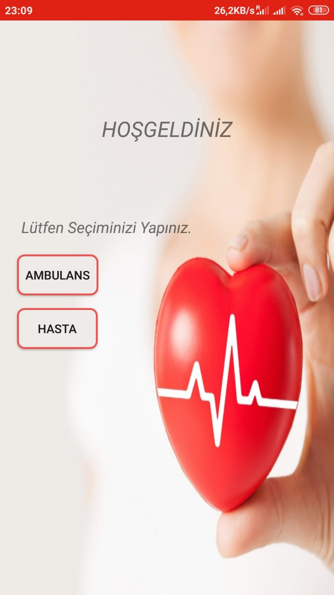
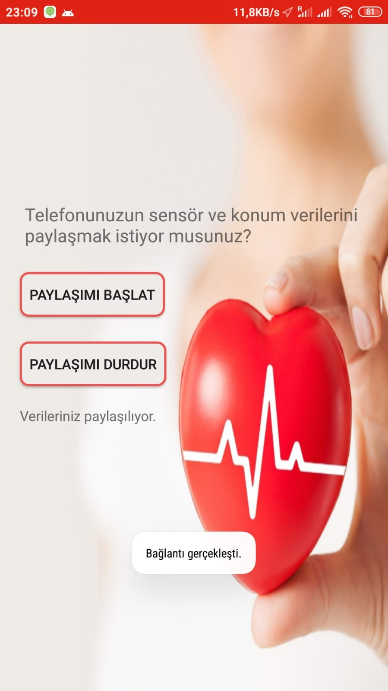
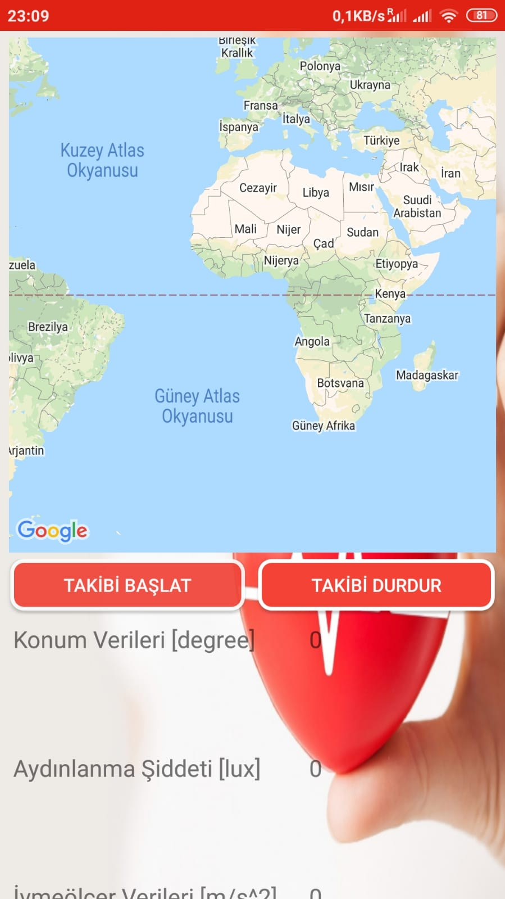

# AmbulanceIOT
HAVELSAN'da yaptığım online staj sürecinde takım arkadaşımla birlikte yaptığımız, Android telefonlar için hasta ve ambulansın birbiri ile haberleşmesini sağlamak amacıyla geliştirilmiş, IoT teknolojilerini kullanan prototip bir Android uygulaması. 

Uygulama hangi amaçla geliştirildi?

Özellikle kırsal kesimlerde ambulans çağırmak ile yola kendi aracıyla çıkmak arasında kalan hastalar için; ambulans sürücüsüne, yola çıkan hastanın GPS verilerini göndererek hasta ile hastane arasında ortak bir noktada buluşmalarını sağlamak amacıyla geliştirildi. Böylece hastaya yapılacak ilk müdahele için beklenen sürenin azaltılması amaçlandı. Ayrıca uygulamada gelecekte üretilmesi muhtemel sağlık sensörleri yerine sembolik olarak ivme ölçer, jiroskop ve ışık sensörü verileri de gönderildi. 

Kullanılan teknolojiler neler?

Eclipse Paho Java Client kütüphanesi, haberleşmenin MQTT protokolü ile gerçekleşmesi için kullanıldı.
Ubidots.com serverları ücretsiz olarak MQTT bağlantısı desteklediği için kullanıldı.
Google Haritalar API, haritalar için kullanıldı.

Projenin dezantajları neler?

-Staj süresince IoT uygulaması olarak gerçekleştirilmesi istendiği için MQTT protokolünü kullanıldı, ancak daha fazla ambulans ve daha fazla hastayı eşleştiren bir sistem kurmak istenirse gelişmiş bir web server üzerinden iletişim kurmak gerekirdi.

-Ubidots.com serverları web arayüzü, büyük çaplı bir operasyonu yönetmek için yeterli değil. Yeni bir arayüz geliştirilmesi gerekiyor. Örneğin daha öncelikli bir hasta ortaya çıktığında, yolda olan ambulansa durumu bildirip öncelikle hastaya yönlendirmek için.

#Uygulamadan görseller

